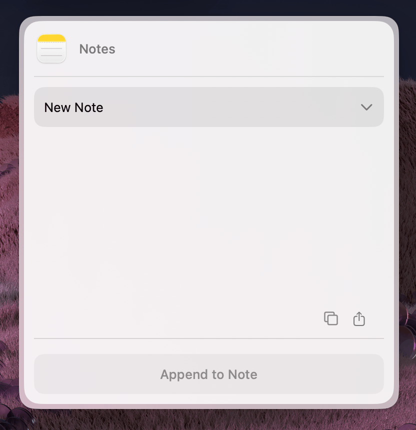

import { Callout } from "fumadocs-ui/components/callout";

**Source:** `extensions/notes-utilities-mcp/`

This extension demonstrates:

1. **Interacting with macOS apps** using the [`useAppleScript`](/docs/hooks/use-apple-script) hook to create and manage content.



---

## What it does

This widget allows users to select an Apple Notes folder from a dropdown menu, enter a title, and compose content using a rich text editor. The extension automatically converts Markdown into HTML before saving the entry as a new note in the selected folder.

---

## Writing notes with useAppleScript

`useAppleScript` is initialized at the top of the component. The returned `runScript` function is then used within the async `createNote` helper to execute AppleScript commands:

```typescript
import { useAppleScript } from "@eney/api";
import markdownit from "markdown-it";
import sanitizeHtml from "sanitize-html";

function CreateNote(props: Props) {
  const runScript = useAppleScript();

  async function createNote(folder: string, name: string, content: string) {
    // Convert Markdown to sanitized HTML before writing to Notes
    const md = markdownit({ breaks: true });
    const htmlContent = md.render(content);
    const sanitizedHtml = sanitizeHtml(htmlContent);
    const escapedFolder = escapeDoubleQuotes(folder);

    const nameHtml = name.trim() ? `<h1>${escapeDoubleQuotes(sanitizeHtml(name))}</h1>` : "";
    const bodyHtml = escapeDoubleQuotes(`${nameHtml}${sanitizedHtml}`);

    return runScript(`
      tell application "Notes"
        set targetFolder to first folder whose name is "${escapedFolder}"
        make new note at targetFolder with properties {body:"${bodyHtml}"}
      end tell
    `);
  }

  // ...
}
```

<Callout type="warn">
  Always escape user-provided strings before interpolating them into AppleScript. Use a helper to replace special characters (like `\` and `"`) to prevent execution errors or injection.
</Callout>

---

## Widget component

```tsx
import { useState } from "react";
import {
  Action,
  ActionPanel,
  defineWidget,
  Form,
  Paper,
  CardHeader,
  useCloseWidget,
  useAppleScript,
  Divider,
} from "@eney/api";
import { useNotes } from "../helpers/use-notes.js";

function escapeDoubleQuotes(value: string) {
  return value.replace(/\\/g, "\\\\").replace(/"/g, '\\"');
}

function CreateNote(props: Props) {
  const runScript = useAppleScript();
  const closeWidget = useCloseWidget();
  const { data, isLoading: isLoadingNotes } = useNotes();

  const folders = [...new Set(data.allFolders.map((f) => f.name))].sort();

  const [folder, setFolder] = useState(props.folder ?? folders[0] ?? "Notes");
  const [name, setName] = useState(props.name ?? "");
  const [content, setContent] = useState(props.content ?? "");
  const [isCreating, setIsCreating] = useState(false);
  const [error, setError] = useState("");

  async function createNote(folder: string, name: string, content: string) {
    const md = markdownit({ breaks: true });
    const htmlContent = md.render(content);
    const sanitizedHtml = sanitizeHtml(htmlContent);
    const escapedFolder = escapeDoubleQuotes(folder);

    const nameHtml = name.trim() ? `<h1>${escapeDoubleQuotes(sanitizeHtml(name))}</h1>` : "";
    const bodyHtml = escapeDoubleQuotes(`${nameHtml}${sanitizedHtml}`);

    return runScript(`
      tell application "Notes"
        set targetFolder to first folder whose name is "${escapedFolder}"
        make new note at targetFolder with properties {body:"${bodyHtml}"}
      end tell
    `);
  }

  async function onSubmit() {
    if (!content.trim()) return;

    setIsCreating(true);
    setError("");

    try {
      await createNote(folder, name, content);
      closeWidget(`Note created successfully in folder "${folder}".`);
    } catch (e) {
      setError(e instanceof Error ? e.message : String(e));
      setIsCreating(false);
    }
  }

  const actions = (
    <ActionPanel>
      <Divider />
      <Action.SubmitForm
        title={isCreating ? "Creating..." : "Create note"}
        onSubmit={onSubmit}
        style="primary"
        isDisabled={!content.trim() || !name.trim()}
        isLoading={isCreating}
      />
    </ActionPanel>
  );

  const header = <CardHeader title="Create note" iconBundleId="com.apple.Notes" />;

  if (isLoadingNotes) {
    return (
      <Form header={header} actions={actions}>
        <Paper markdown="Loading notes..." />
      </Form>
    );
  }

  return (
    <Form header={header} actions={actions}>
      {error && <Paper markdown={`**Error:** ${error}`} />}
      {folders.length > 1 && (
        <Form.Dropdown name="folder" label="Folder" value={folder} onChange={setFolder}>
          {folders.map((f) => (
            <Form.Dropdown.Item key={f} title={f} value={f} />
          ))}
        </Form.Dropdown>
      )}
      <Form.TextField name="name" label="Note Name" value={name} onChange={setName} />
      <Form.RichTextEditor value={content} onChange={setContent} isInitiallyFocused />
    </Form>
  );
}
```

---

## Key patterns to copy

- Convert Markdown to sanitized HTML before writing to Notes — the Notes app stores HTML, not plain text
- Use the `useLogger` inside hooks for debug output. This keeps your logs in the developer console and prevents them from cluttering the extension's UI.
- Always call `closeWidget(context)` with a meaningful context string so Eney knows what happened
- Show a loading state while fetching data. Display an inline error message if fetching fails, do not abruptly close the widget.
