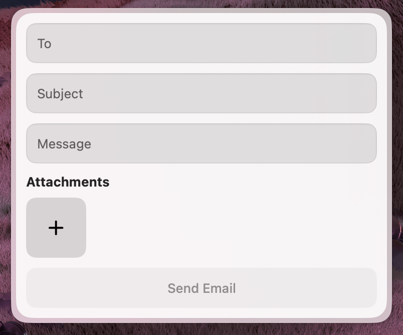

import { Callout } from "fumadocs-ui/components/callout";

**Source:** `extensions/send-mail-mcp/`

This extension demonstrates how to trigger outgoing communication through Apple Mail. It also shows how to handle file attachments, including size validation logic.



---

## What it does

The widget provides a form with fields for the recipient, subject, and message body. It includes a dedicated attachment field that automatically enforces a **20 MB size limit**. Once the form is complete, the extension generates and sends the email through the native Mail app using AppleScript.

---

## Widget schema

All fields are `.optional()` — Eney fills what it knows from context, and the user completes the rest in the form.

```typescript
const props = z.object({
  recipient: z.string().optional().describe("Email recipient address"),
  subject: z.string().optional().describe("Email subject"),
  body: z.string().optional().describe("Email body text"),
  attachments: z.array(z.string()).optional().describe("Array of file paths to attach"),
});
```

---

## Sending mail with useAppleScript

Call `useAppleScript()` at the top of your component. Then, use the `runScript` function inside your `sendMail` helper to execute the script.


```typescript
import { useAppleScript, useCloseWidget } from "@eney/api";

function escapeAppleScript(str: string): string {
  return str.replace(/\\/g, "\\\\").replace(/"/g, '\\"');
}

function SendMail(props: Props) {
  const runScript = useAppleScript();
  const closeWidget = useCloseWidget();

  async function sendMail(
    recipient: string,
    subject: string,
    body: string,
    attachments: string[],
  ): Promise<string> {
    const attachmentsList = attachments
      .map((path) => `"${escapeAppleScript(path)}"`)
      .join(", ");

    const script = `
tell application "Mail"
  set theMessage to make new outgoing message with properties {
    subject:"${escapeAppleScript(subject)}",
    content:"${escapeAppleScript(body)}",
    visible:false
  }
  tell theMessage
    make new to recipient at end of to recipients with properties {
      address:"${escapeAppleScript(recipient)}"
    }
    ${attachments.length > 0 ? `
    set theAttachments to {${attachmentsList}}
    repeat with theAttachment in theAttachments
      set theAttachmentAlias to POSIX file theAttachment
      make new attachment with properties {file name:theAttachmentAlias} at after last paragraph
      delay 1
    end repeat` : ""}
  end tell
  send theMessage
end tell
`;
    return runScript(script);
  }

  async function onSubmit() {
    try {
      await sendMail(recipient, subject, body, attachments);
      closeWidget(`Message sent successfully to **${recipient}** with subject **${subject}**`);
    } catch (error) {
      closeWidget(`Failed to send email: ${error instanceof Error ? error.message : String(error)}`);
    }
  }

  // ...
}
```

<Callout type="warn">
  Always escape user input before interpolating into AppleScript strings. Replace `\` with `\\` and `"` with `\"`.
</Callout>

---

## Attachment size validation

The component checks each selected file before enabling the submit button:

```typescript
const MAX_FILE_SIZE_MB = 20;
const MAX_FILE_SIZE_BYTES = MAX_FILE_SIZE_MB * 1024 * 1024;

function getOversizedFiles(filePaths: string[]): OversizedFile[] {
  return filePaths
    .filter((filePath) => {
      try {
        return statSync(filePath).size > MAX_FILE_SIZE_BYTES;
      } catch {
        return false;
      }
    })
    .map((filePath) => ({
      path: filePath,
      name: basename(filePath),
      sizeMB: Math.round((statSync(filePath).size / (1024 * 1024)) * 100) / 100,
    }));
}
```

Oversized files are shown as inline error messages in the form, and the submit button is disabled until they are removed:

```tsx
const hasOversizedFiles = oversizedFiles.length > 0;

<Action.SubmitForm
  title="Send Email"
  onSubmit={onSubmit}
  isDisabled={!recipient || !subject || hasOversizedFiles}
/>
```

---

## Key patterns

- Call `useAppleScript()` at the top of the component and use the returned `runScript` inside your async helpers
- Validate files inline and disable the submit button to guide the user, rather than showing an error after they click send
- Always call `closeWidget` in both success and error paths so Eney receives the result either way
- AppleScript automation requires the user to grant permission in **System Settings → Privacy & Security → Automation** on first run
