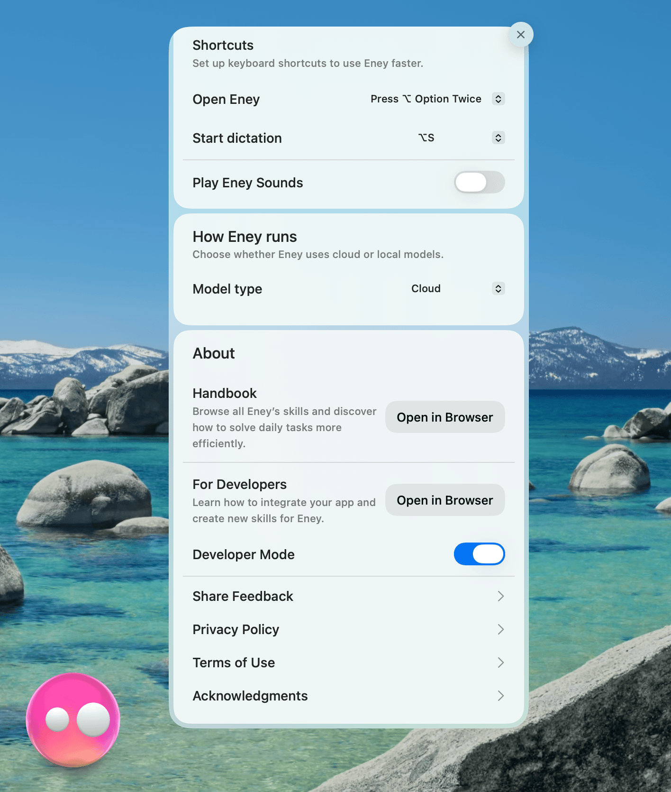

import { Step, Steps } from "fumadocs-ui/components/steps";
import { Callout } from "fumadocs-ui/components/callout";

Eney extensions (also referred to as skills) are MCP (Model Context Protocol) servers that expose interactive widgets to the Eney app. You write React components using the `@eney/api` widget library — the framework renders them as native macOS UI.

This guide walks you through creating a complete extension from scratch.

## Prerequisites

- Node.js 24+
- npm

## Setup

<Steps>
<Step>
Clone the repository and run the setup script:

```bash
git clone https://github.com/MacPaw/eney-skills
cd eney-skills
./setup.sh
```

This installs the CLI dependencies and registers the `eney-skills-cli` command globally. You only need to do this once after cloning the repository.
</Step>

<Step>
Enable developer mode in Eney (Right click on the Eney app → Settings → Scroll to "Developer mode") to allow loading your local extensions.



</Step>

</Steps>

## Create an Extension

<Steps>

<Step>
### Set up your extension

There are two ways to scaffold a new extension:

**Option A: Using Claude Code**

If you have [Claude Code](https://docs.anthropic.com/en/docs/claude-code) installed, use the `/eney-create` skill. It will scaffold the extension, implement the widget, and build it for you interactively:

```
/eney-create
```

Claude Code will ask you for the extension details and handle the rest. You can skip ahead to [Run in dev mode](#run-in-dev-mode) once it's done.

**Option B: Using CLI directly**

Scaffold a new extension manually:

```bash
eney-skills-cli create ...options
```

Example call with all required options:


```bash
eney-skills-cli create --id weather-forecaster \
  --mcp-title="Your town forecast" \
  --tool-name="get-weather-forecast" \
  --tool-description="Get Weather Forecast" \
  --tool-title="Get Weather Forecast"
```

This creates a new folder—located in the extensions/ folder by default—containing boilerplate code for your extension. It includes:

- `manifest.json` - defines your MCP metadata
- `package.json` - your dependencies and scripts. **NOTE**: A build script is required for CLI commands to function.
- `tsconfig.json` - TypeScript configuration
- `tests/` - folder for your tests
- `components/` - folder for your React components (widgets)
- `index.ts` - entry point for your extension

</Step>

<Step>
### Implement your widget

Using the `tool-name` we have provided during creation, the CLI has generated a boilerplate widget for us. It is located in the `components/` folder.

```tsx
import { useState } from "react";
import { z } from "zod";
import {
  Action,
  ActionPanel,
  Form,
  Paper,
  defineWidget,
  useCloseWidget,
} from "@eney/api";

const schema = z.object({
  name: z.string().optional().describe("The name to greet."),
});

type Props = z.infer<typeof schema>;
```

<Callout type="warn">
  It is important to define a schema for your widget’s props. This allows Eney to understand the required input for the widget and provide a smoother experience for users.
</Callout>

```tsx
function GetWeatherForecast(props: Props) {
  const closeWidget = useCloseWidget();
  const [name, setName] = useState(props.name ?? "");
  const [result, setResult] = useState("");

  function onSubmit() {
    setResult(`Hello, ${name}!`);
  }

  function onDone() {
    closeWidget("Done");
  }
```

<Callout type="info">
  `closeWidget` is used to finalize the interaction for the user and pass context back to Eney. Without calling it, the user’s only way to close the widget is by clicking the "X" button, which cancels the operation.
</Callout>

```tsx
  const actions = (
    <ActionPanel>
      <Action.SubmitForm title="Submit" onSubmit={onSubmit} style="secondary" />
      <Action title="Done" onAction={onDone} style="primary" />
    </ActionPanel>
  );

  return (
    <Form actions={actions}>
      {result && <Paper markdown={result} />}
      <Form.TextField
        name="name"
        label="Name"
        value={name}
        onChange={setName}
      />
    </Form>
  );
}

const GetWeatherForecastWidget = defineWidget({
  name: "get-weather-forecast",
  description: "Get Weather Forecast",
  schema,
  component: GetWeatherForecast,
});

export default GetWeatherForecastWidget;
```

<Callout type="info">
  `defineWidget` is the function that registers your widget and its metadata. Eney uses it to determine when to call the widget and which props to provide.
</Callout>

</Step>

<Step>
### Verify it compiles

Run the build script to ensure your project is configured correctly:

```bash
npm run build
```

A successful build with no errors means your extension is ready to go.

</Step>

<Step>
### Run in dev mode

The CLI `dev` command compiles, deploys locally, and watches for changes:

```bash
eney-skills-cli dev
```

This command moves the compiled output to the Eney MCP folder and generates the tool definitions required for Eney to discover and load your widget.

</Step>

<Step>
### Launch in Eney

Trigger the widget directly using a macOS deeplink:

```bash
open "eney://run?manifestID=eney_core&commandID=get-weather-forecast"
```

The `commandID` matches the `name` field defined in your `defineWidget()` call (found in index.ts).

You can also find this specific `open` command printed in the terminal output of the `dev` command.

</Step>

</Steps>

## Next Steps

- Read [Extension Structure](/docs/extension-structure) to understand each file's role
- Browse the [Widgets](/docs/widgets) reference for all available UI components
- Study existing extensions in `extensions/` for real-world patterns
