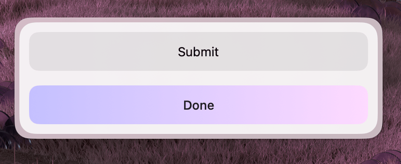

Groups a set of [actions](/docs/widgets/actions) that the user can perform. Typically passed to a `Form` or `Paper` via the `actions` prop.



### Properties

| Property   | Description      | Type                | Default    | Required |
| ---------- | ---------------- | ------------------- | ---------- | -------- |
| `children` | Action elements  | `React.ReactNode`   | —          | Yes      |
| `layout`   | Layout direction | `"row" \| "column"` | `"column"` | No       |

### Usage

```tsx
import { useState } from "react";
import { Form, Action, ActionPanel } from "@eney/api";

function MyWidget() {
  const [file, setFile] = useState("");

  function onSubmit() {
    // process the file
  }

  const actions = (
    <ActionPanel>
      <Action.SubmitForm title="Process" onSubmit={onSubmit} style="primary" />
      <Action.ShowInFinder title="Show in Finder" path={file} />
    </ActionPanel>
  );

  return (
    <Form actions={actions}>
      <Form.FilePicker
        name="file"
        label="Select file"
        value={file}
        onChange={setFile}
      />
    </Form>
  );
}
```

### Row layout


Use `layout="row"` to display actions side by side:

```tsx
<ActionPanel layout="row">
  <Action title="Accept" onAction={onAccept} style="primary" />
  <Action title="Decline" onAction={onDecline} />
</ActionPanel>
```
