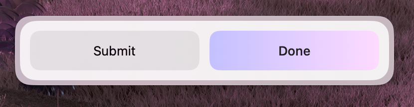

Actions are buttons that trigger behavior when clicked. The library includes several built-in action types for common operations. For custom behavior, use the base `Action` component.

All actions share a common set of style props:

| Property     | Description              | Type                       | Default       |
| ------------ | ------------------------ | -------------------------- | ------------- |
| `title`      | Button label             | `string`                   | varies        |
| `style`      | Button style variation   | `"primary" \| "secondary"` | `"secondary"` |
| `isLoading`  | Show a loading indicator | `boolean`                  | —             |
| `isDisabled` | Disable the button       | `boolean`                  | —             |

---

## Action

A custom action button. Use this when the built-in action types don't cover your use case.

### Properties

| Property     | Description                                   | Type                       | Default       | Required |
| ------------ | --------------------------------------------- | -------------------------- | ------------- | -------- |
| `title`      | The title displayed on the button             | `string`                   | —             | Yes      |
| `onAction`   | Callback triggered when the button is clicked | `() => void`               | —             | Yes      |
| `style`      | Button style variation                        | `"primary" \| "secondary"` | `"secondary"` | No       |
| `isLoading`  | Show a loading indicator                      | `boolean`                  | —             | No       |
| `isDisabled` | Disable the button                            | `boolean`                  | —             | No       |

### Usage

```tsx
import { Action, ActionPanel } from "@eney/api";

function MyWidget() {
  function handleRefresh() {
    // custom action logic
  }

  return (
    <ActionPanel>
      <Action title="Refresh" onAction={handleRefresh} />
    </ActionPanel>
  );
}
```

---

## Action.SubmitForm

Triggers a form submission handler. Typically used inside an `ActionPanel` that is passed to a `Form`.

### Properties

| Property     | Description                       | Type                       | Default       | Required |
| ------------ | --------------------------------- | -------------------------- | ------------- | -------- |
| `title`      | The title displayed on the button | `string`                   | —             | Yes      |
| `onSubmit`   | Callback triggered on form submit | `() => void`               | —             | Yes      |
| `style`      | Button style variation            | `"primary" \| "secondary"` | `"secondary"` | No       |
| `isLoading`  | Show a loading indicator          | `boolean`                  | —             | No       |
| `isDisabled` | Disable the button                | `boolean`                  | —             | No       |

### Usage

```tsx
import { useState } from "react";
import { Form, Action, ActionPanel } from "@eney/api";

function MyWidget() {
  const [name, setName] = useState("");
  const [loading, setLoading] = useState(false);

  async function onSubmit() {
    setLoading(true);
    // process the form data
    setLoading(false);
  }

  return (
    <Form
      actions={
        <ActionPanel>
          <Action.SubmitForm
            title="Save"
            onSubmit={onSubmit}
            style="primary"
            isLoading={loading}
          />
        </ActionPanel>
      }
    >
      <Form.TextField
        name="name"
        label="Name"
        value={name}
        onChange={setName}
      />
    </Form>
  );
}
```

---

## Action.ShowInFinder

Opens a file or folder in macOS Finder.

### Properties

| Property     | Description                       | Type                       | Default            | Required |
| ------------ | --------------------------------- | -------------------------- | ------------------ | -------- |
| `path`       | The file path to reveal in Finder | `string`                   | —                  | Yes      |
| `title`      | The title displayed on the button | `string`                   | `"Show in Finder"` | No       |
| `style`      | Button style variation            | `"primary" \| "secondary"` | `"secondary"`      | No       |
| `isDisabled` | Disable the button                | `boolean`                  | —                  | No       |

### Usage

```tsx
import { Action, ActionPanel } from "@eney/api";

<ActionPanel>
  <Action.ShowInFinder path="/Users/me/Documents/report.pdf" />
</ActionPanel>;
```

---

## Action.CopyToClipboard

Copies text content to the system clipboard.

### Properties

| Property     | Description                                   | Type                       | Default       | Required |
| ------------ | --------------------------------------------- | -------------------------- | ------------- | -------- |
| `content`    | The text that will be copied to the clipboard | `string`                   | —             | Yes      |
| `title`      | The title displayed on the button             | `string`                   | `"Copy"`      | No       |
| `style`      | Button style variation                        | `"primary" \| "secondary"` | `"secondary"` | No       |
| `isDisabled` | Disable the button                            | `boolean`                  | —             | No       |

### Usage

```tsx
import { Action, ActionPanel, Paper } from "@eney/api";

function ResultView(props: { result: string }) {
  return (
    <Paper
      markdown={props.result}
      actions={
        <ActionPanel>
          <Action.CopyToClipboard content={props.result} />
        </ActionPanel>
      }
    />
  );
}
```
