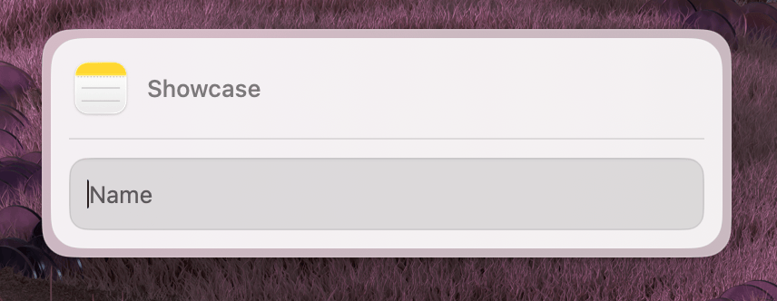

Renders a header with a title and an optional application icon. Use this as the `header` prop on a `Form`.

### Properties

| Property       | Description                               | Type     | Default | Required |
| -------------- | ----------------------------------------- | -------- | ------- | -------- |
| `title`        | The header title text                     | `string` | —       | Yes      |
| `iconBundleId` | macOS bundle identifier for the app icon  | `string` | —       | No       |

### Usage

```tsx
import { Form, CardHeader, Action, ActionPanel } from '@macpaw/eney-api';

function MyWidget() {
  const header = <CardHeader title="Image Optimizer" iconBundleId="com.apple.Preview" />;

  return (
    <Form
      header={header}
      actions={
        <ActionPanel>
          <Action.SubmitForm title="Run" onSubmit={() => {}} />
        </ActionPanel>
      }
    >
      {/* form fields */}
    </Form>
  );
}
```

The `iconBundleId` is a macOS application bundle identifier (e.g. `com.apple.Safari`, `com.apple.Preview`). When provided, the host application displays the corresponding app icon next to the title.
