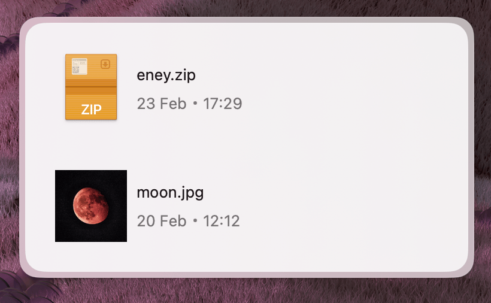

Shows output files after a task completes. Users can click each file to open it.



## Properties

### Files

The main container for the file list.

| Property   | Description             | Type              | Default | Required |
| ---------- | ----------------------- | ----------------- | ------- | -------- |
| `children` | `Files.Item` components | `React.ReactNode` | —       | Yes      |

### Files.Item

Represents an individual file within the list.

| Property | Description               | Type     | Default | Required |
| -------- | ------------------------- | -------- | ------- | -------- |
| `path`   | Absolute path to the file | `string` | —       | Yes      |

## Usage

To display files, wrap individual `Files.Item` components inside the `Files` parent component.

### Basic

You can map through an array of file paths to generate the list dynamically:

```tsx
import { Files } from "@eney/api";

function OutputFiles(props: { paths: string[] }) {
  return (
    <Files>
      {props.paths.map((file) => (
        <Files.Item key={file} path={file} />
      ))}
    </Files>
  );
}
```

### Full example — file processing widget

Ideal for showing results after a process, like an image optimizer. If files exist, the widget shows the file list; otherwise, it shows the upload form:

```tsx
import { useState } from "react";
import { Form, Action, ActionPanel, Files } from "@eney/api";

function ImageOptimizer() {
  const [inputImage, setInputImage] = useState("");
  const [outputFiles, setOutputFiles] = useState<string[]>([]);
  const [loading, setLoading] = useState(false);

  async function onSubmit() {
    setLoading(true);
    // process the image and produce output files
    const optimized = [
      "/output/image-optimized.webp",
      "/output/image-compressed.jpg",
    ];
    setOutputFiles(optimized);
    setLoading(false);
  }

  if (outputFiles.length > 0) {
    return (
      <Files>
        {outputFiles.map((file) => (
          <Files.Item key={file} path={file} />
        ))}
      </Files>
    );
  }

  return (
    <Form
      actions={
        <ActionPanel>
          <Action.SubmitForm
            title={loading ? "Optimizing..." : "Optimize"}
            onSubmit={onSubmit}
            isLoading={loading}
          />
        </ActionPanel>
      }
    >
      <Form.FilePicker
        name="inputImage"
        label="Select image"
        value={inputImage}
        onChange={setInputImage}
      />
    </Form>
  );
}
```
