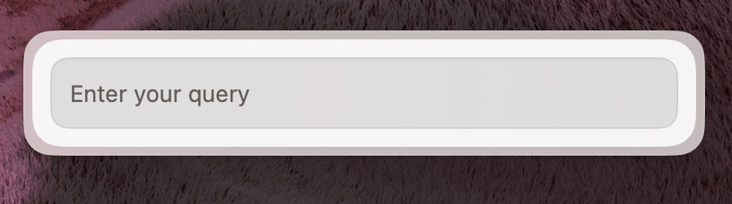
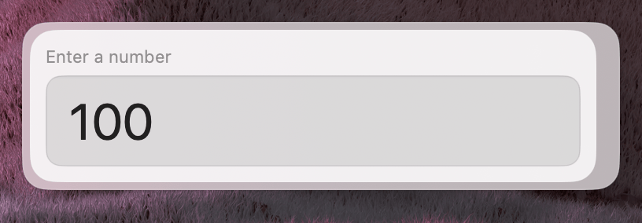
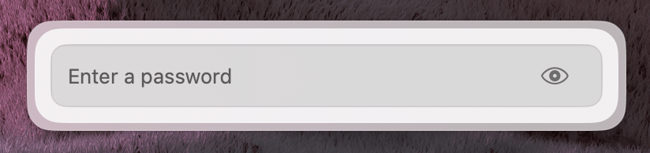
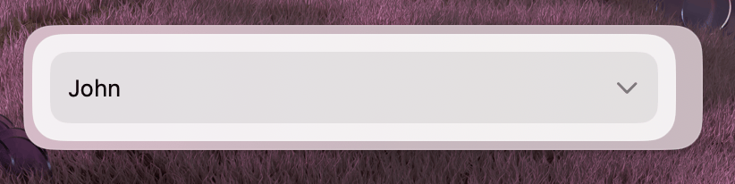
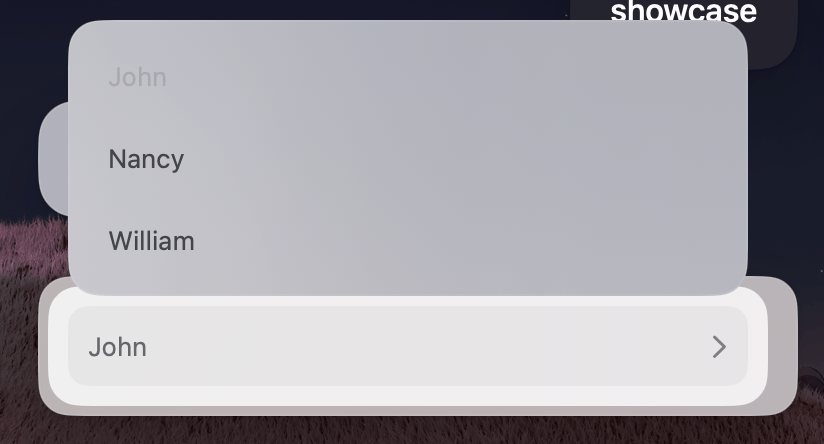
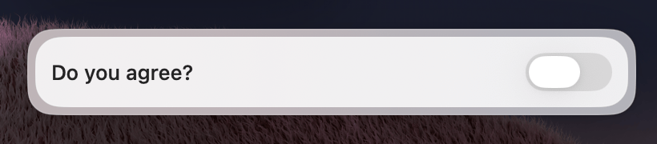
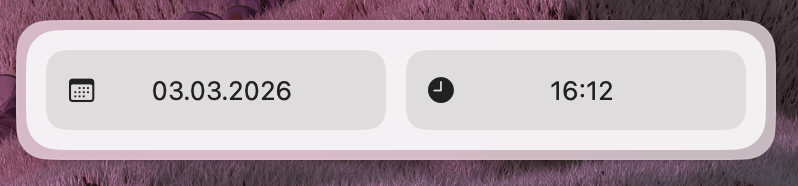
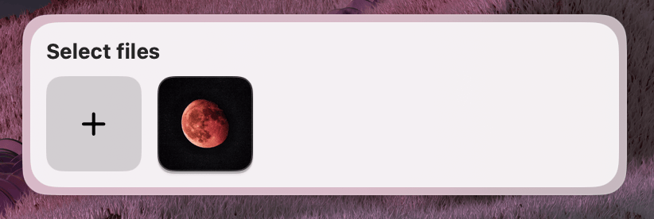
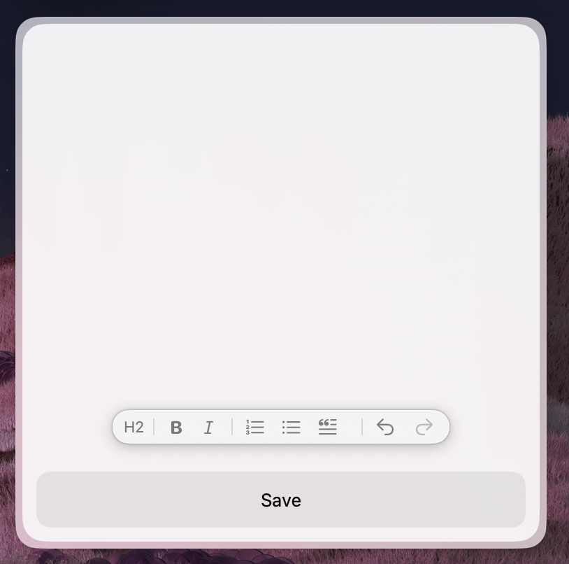

The Form is the primary container for user input. It consists of three sections:

1. **Header** — an optional header element (e.g. a `CardHeader`)
2. **Form fields** — laid out in a column
3. **ActionPanel** — a panel with [actions](/docs/widgets/action-panel) for the form

All form fields are **controlled**. That means:

- The component holds the source of truth (e.g. via `useState`)
- The field's `value` comes from state
- The field's `onChange` updates that state

| Property   | Description                    | Type              | Default | Required |
| ---------- | ------------------------------ | ----------------- | ------- | -------- |
| `children` | Form fields                    | `React.ReactNode` | —       | Yes      |
| `actions`  | A reference to an ActionPanel  | `React.ReactNode` | —       | No       |
| `header`   | Header element                 | `React.ReactNode` | —       | No       |

```tsx
import { useState } from 'react';
import { Form, Action, ActionPanel } from '@eney/api';

function MyForm() {
  const [name, setName] = useState('');

  function onSubmit() {
    // handle form submit
  }

  const actions = (
    <ActionPanel>
      <Action.SubmitForm title="Submit" onSubmit={onSubmit} />
    </ActionPanel>
  );

  return (
    <Form actions={actions}>
      <Form.TextField name="name" label="Name" value={name} onChange={setName} />
    </Form>
  );
}
```

---

## Form.TextField



Single-line text input.

| Property     | Description                                         | Type                      | Default | Required |
| ------------ | --------------------------------------------------- | ------------------------- | ------- | -------- |
| `name`       | Unique name of the form field                       | `string`                  | —       | Yes      |
| `value`      | The current value of the field                      | `string`                  | `""`    | No       |
| `onChange`   | Callback triggered when the value changes           | `(value: string) => void` | —       | Yes      |
| `label`      | The label displayed for the field                   | `string`                  | —       | No       |
| `isCopyable` | Whether the field shows a copy button               | `boolean`                 | —       | No       |

```tsx
import { useState } from 'react';
import { Form } from '@eney/api';

function MyWidget() {
  const [city, setCity] = useState('');

  return (
    <Form>
      <Form.TextField name="city" label="City" value={city} onChange={setCity} />
    </Form>
  );
}
```

---

## Form.NumberField



Numeric input with optional min/max bounds.

| Property   | Description                                         | Type                              | Default | Required |
| ---------- | --------------------------------------------------- | --------------------------------- | ------- | -------- |
| `name`     | Unique name of the form field                       | `string`                          | —       | Yes      |
| `value`    | The current value of the field                      | `number \| null`                  | `0`     | No       |
| `onChange`  | Callback triggered when the value changes          | `(value: number \| null) => void` | —       | Yes      |
| `label`    | The label displayed for the field                   | `string`                          | —       | No       |
| `min`      | Minimum allowed value                               | `number`                          | —       | No       |
| `max`      | Maximum allowed value                               | `number`                          | —       | No       |No       |

```tsx
import { useState } from 'react';
import { Form } from '@eney/api';

function MyWidget() {
  const [quantity, setQuantity] = useState<number | null>(1);

  return (
    <Form>
      <Form.NumberField
        name="quantity"
        label="Quantity"
        value={quantity}
        onChange={setQuantity}
        min={1}
        max={100}
      />
    </Form>
  );
}
```

---

## Form.PasswordField



Masked text input for sensitive values.

| Property   | Description                                         | Type                      | Default | Required |
| ---------- | --------------------------------------------------- | ------------------------- | ------- | -------- |
| `name`     | Unique name of the form field                       | `string`                  | —       | Yes      |
| `value`    | The current value of the field                      | `string`                  | `""`    | No       |
| `onChange`  | Callback triggered when the value changes          | `(value: string) => void` | —       | Yes      |
| `label`    | The label displayed for the field                   | `string`                  | —       | No       |

```tsx
import { useState } from 'react';
import { Form } from '@eney/api';

function MyWidget() {
  const [apiKey, setApiKey] = useState('');

  return (
    <Form>
      <Form.PasswordField
        name="apiKey"
        label="API Key"
        value={apiKey}
        onChange={setApiKey}
      />
    </Form>
  );
}
```

---

## Form.Dropdown



Select or searchable autocomplete. Behaves like a `<select>` by default. When `searchable` is `true`, it works as a search field with suggestions (similar to `<datalist>`).

| Property     | Description                                         | Type                      | Default | Required |
| ------------ | --------------------------------------------------- | ------------------------- | ------- | -------- |
| `name`       | Unique name of the form field                       | `string`                  | —       | Yes      |
| `value`      | The current selected value                          | `string`                  | —       | No       |
| `onChange`    | Callback triggered when the value changes           | `(value: string) => void` | —       | Yes      |
| `label`      | The label displayed for the field                   | `string`                  | —       | No       |
| `searchable` | Whether to show a search field with autocomplete    | `boolean`                 | `false` | No       |
| `children`   | `Form.Dropdown.Item` elements                       | `React.ReactNode`         | —       | Yes      |

---

## Form.Dropdown.Item



| Property | Description                       | Type     | Default | Required |
| -------- | --------------------------------- | -------- | ------- | -------- |
| `value`  | Unique value of the dropdown item | `string` | —       | Yes      |
| `title`  | The title displayed for the item  | `string` | —       | Yes      |

```tsx
import { useState } from 'react';
import { Form } from '@eney/api';

function MyWidget() {
  const [currency, setCurrency] = useState('usd');

  return (
    <Form>
      <Form.Dropdown
        name="currency"
        label="Currency"
        value={currency}
        onChange={setCurrency}
      >
        <Form.Dropdown.Item value="usd" title="USD" />
        <Form.Dropdown.Item value="eur" title="EUR" />
        <Form.Dropdown.Item value="uah" title="UAH" />
        <Form.Dropdown.Item value="pln" title="PLN" />
      </Form.Dropdown>
    </Form>
  );
}
```

---

## Form.Checkbox



Toggle input that can be displayed as a checkbox or a switch.

| Property   | Description                                         | Type                       | Default      | Required |
| ---------- | --------------------------------------------------- | -------------------------- | ------------ | -------- |
| `name`     | Unique name of the form field                       | `string`                   | —            | Yes      |
| `label`    | The label displayed for the field                   | `string`                   | —            | Yes      |
| `checked`  | The current state of the checkbox                   | `boolean`                  | —            | Yes      |
| `onChange`  | Callback triggered when the value changes          | `(value: boolean) => void` | —            | Yes      |
| `variant`  | Display variant                                     | `"checkbox" \| "switch"`   | `"checkbox"` | No       |No       |

```tsx
import { useState } from 'react';
import { Form } from '@eney/api';

function MyWidget() {
  const [enabled, setEnabled] = useState(false);

  return (
    <Form>
      <Form.Checkbox
        name="notifications"
        label="Enable notifications"
        checked={enabled}
        onChange={setEnabled}
        variant="switch"
      />
    </Form>
  );
}
```

---

## Form.DatePicker



Date, time, or datetime picker.

| Property   | Description                                         | Type                        | Default      | Required |
| ---------- | --------------------------------------------------- | --------------------------- | ------------ | -------- |
| `name`     | Unique name of the form field                       | `string`                    | —            | Yes      |
| `label`    | The label displayed for the field                   | `string`                    | —            | Yes      |
| `value`    | The current date value                              | `Date`                      | —            | Yes      |
| `onChange`  | Callback triggered when the value changes          | `(value: Date) => void`     | —            | Yes      |
| `type`     | The types of date components the user can pick      | `"date" \| "time" \| "datetime"` | `"datetime"` | No  |No       |

```tsx
import { useState } from 'react';
import { Form, Paper, Action, ActionPanel } from '@eney/api';

function CountdownWidget() {
  const [date, setDate] = useState<Date>(new Date());
  const [result, setResult] = useState<string | undefined>();

  function onSubmit() {
    const now = new Date();
    const delta = date.getTime() - now.getTime();
    const days = Math.floor(delta / (1000 * 60 * 60 * 24));
    setResult(`${days} days remaining`);
  }

  return (
    <Form
      actions={
        <ActionPanel>
          <Action.SubmitForm title="Calculate" onSubmit={onSubmit} />
        </ActionPanel>
      }
    >
      <Form.DatePicker name="date" label="Target date" value={date} onChange={setDate} type="date" />
      {result && <Paper markdown={result} />}
    </Form>
  );
}
```

---

## Form.FilePicker



File selection. Supports single or multiple file selection.

> The user may delete or move selected files between picking them and submitting the form. Always verify that files exist before acting on them.

| Property   | Description                                                                                                    | Type                                  | Default | Required |
| ---------- | -------------------------------------------------------------------------------------------------------------- | ------------------------------------- | ------- | -------- |
| `name`     | Unique name of the form field                                                                                  | `string`                              | —       | Yes      |
| `label`    | The label displayed for the field                                                                              | `string`                              | —       | No       |
| `value`    | Current file path(s). If `multiple` is `true`, expects an array                                                | `string \| string[]`                  | —       | No       |
| `onChange`  | Callback triggered when selection changes                                                                     | `(value: string \| string[]) => void` | —       | Yes      |
| `multiple` | Allow selecting multiple files                                                                                 | `boolean`                             | `false` | No       |
| `accept`   | [Uniform Type Identifiers](https://developer.apple.com/documentation/uniformtypeidentifiers) to filter by type | `string[]`                            | —       | No       |

```tsx
import { useState } from 'react';
import { Form } from '@eney/api';

function MyWidget() {
  const [files, setFiles] = useState<string[]>([]);

  return (
    <Form>
      <Form.FilePicker
        name="attachments"
        label="Select files"
        value={files}
        onChange={setFiles}
        multiple
      />
    </Form>
  );
}
```

---

## Form.RichTextEditor



Multi-line rich text editor.

| Property             | Description                                       | Type                      | Default | Required |
| -------------------- | ------------------------------------------------- | ------------------------- | ------- | -------- |
| `value`              | The current text content                          | `string`                  | `""`    | No       |
| `onChange`            | Callback triggered when the content changes       | `(value: string) => void` | —       | Yes      |
| `isInitiallyFocused` | Whether the editor receives focus on mount        | `boolean`                 | —       | No       |No       |

```tsx
import { useState } from 'react';
import { Form, Action, ActionPanel } from '@eney/api';

function NoteEditor() {
  const [content, setContent] = useState('');

  function onSubmit() {
    // process content
  }

  return (
    <Form
      actions={
        <ActionPanel>
          <Action.SubmitForm title="Save" onSubmit={onSubmit} />
        </ActionPanel>
      }
    >
      <Form.RichTextEditor value={content} onChange={setContent} isInitiallyFocused />
    </Form>
  );
}
```
