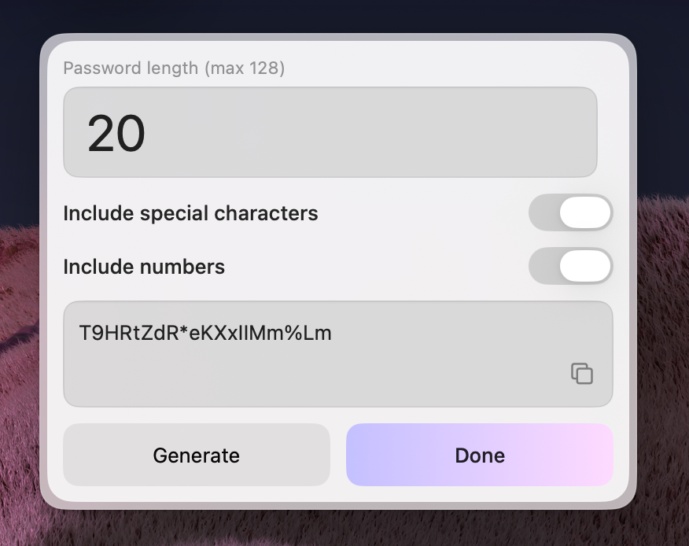

import { Callout } from "fumadocs-ui/components/callout";
import { Card, Cards } from "fumadocs-ui/components/card";
import { Step, Steps } from "fumadocs-ui/components/steps";

Eney widgets provide a JSX-based interface for building native UI. You write standard React components using the widget library — the JSX renders into a JSON tree that the native Swift app interprets and displays as fully native UI elements.

Your code never touches UIKit or SwiftUI directly. The runtime serializes your component tree into JSON messages, and Eney handles the native rendering for you.

```
JSX Component → JSON tree → Native Swift UI
```

The following image shows a password generator widget built using native Eney components:



## Import

All widgets are exported from `@eney/api`:

```tsx
import {
  Form,
  Paper,
  Action,
  ActionPanel,
  Files,
  CardHeader,
  setupTool,
} from "@eney/api";
```

## Available Widgets

<Cards>
  <Card title="Paper" href="/docs/widgets/paper">
    Display markdown content with optional scrolling and actions.
  </Card>
  <Card title="Form" href="/docs/widgets/form">
    Container for interactive form fields with header and actions.
  </Card>
  <Card title="Actions" href="/docs/widgets/actions">
    Buttons for submission, clipboard, Finder, and finalization.
  </Card>
  <Card title="ActionPanel" href="/docs/widgets/action-panel">
    Layout container for grouping action buttons.
  </Card>
  <Card title="CardHeader" href="/docs/widgets/card-header">
    Header with title and icon for forms.
  </Card>
  <Card title="Files" href="/docs/widgets/files">
    Display a list of file paths.
  </Card>
</Cards>
