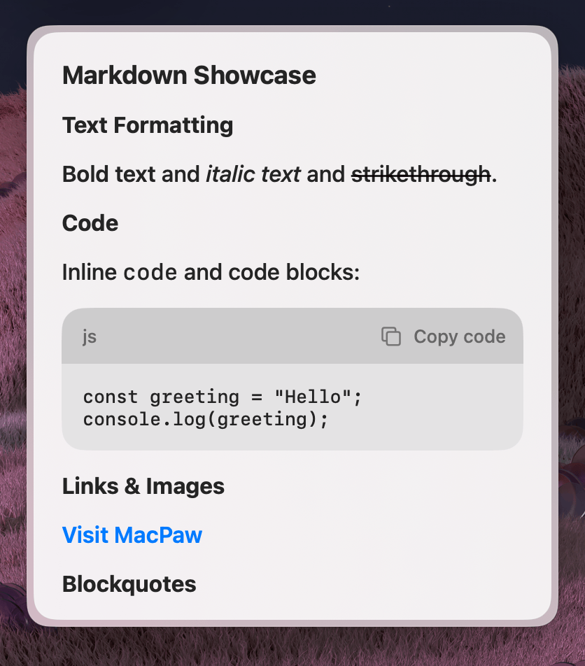

Renders markdown content with an optional action panel. Use this component to display results, summaries, or any read-only content.



### Properties

| Property       | Description                            | Type              | Default | Required |
| -------------- | -------------------------------------- | ----------------- | ------- | -------- |
| `markdown`     | Markdown string to render              | `string`          | —       | No       |
| `actions`      | A reference to an ActionPanel          | `React.ReactNode` | —       | No       |
| `isScrollable` | Whether the content area is scrollable | `boolean`         | —       | No       |

## Usage

To use the component, import it from the `@eney/api` library and pass your Markdown string to the `markdown` prop.

### Basic

A simple way to display a single line of Markdown:

```tsx
<Paper markdown="Hello **world**" />
```

### Scrollable content

For long content, enable scrolling:

```tsx
<Paper markdown={longMarkdown} isScrollable />
```

### With actions

Pair with an `ActionPanel` to let users interact with the displayed content, such as copying the result to their clipboard:

```tsx
import { Paper, Action, ActionPanel } from "@eney/api";

function ResultView(props: { result: string }) {
  const actions = (
    <ActionPanel>
      <Action.CopyToClipboard content={props.result} title="Copy" />
    </ActionPanel>
  );

  return <Paper markdown={props.result} actions={actions} />;
}
```
